# NexusFleet — LLM Code Generation Benchmark

This repository contains three independent implementations of **NexusFleet**, a real-time multi-tenant fleet management platform, generated by three different LLM code generation agents:

- **`cursor/`** — Generated by Cursor (Agent mode, Opus 4.6)
- **`claudecode/`** — Generated by Claude Code (direct CLI, single session)
- **`angy-v2/`** — Generated by Angy v2 (orchestrated Claude Code multi-agent pipeline, second run)

All three agents were given the same specification (`epic.md`) and asked to produce a complete, working application from scratch.

> **Note on Angy versioning.** A first run of the Angy pipeline (`angy/`) was completed before this one. It produced a largely working implementation but still required 5 manual code fixes before `docker compose up` succeeded. That run is preserved in `angy/` for reference. **Angy v2** (`angy-v2/`) is a new run of the same pipeline — same spec, same model, improved internal tooling — and is the result used in this comparison. It is the first of all four runs to cold-start without any manual intervention.

## Why This Epic Is Hard

The specification is deliberately engineered to **expose the failure modes of single-pass code generation**. Most LLM coding benchmarks test isolated tasks — write a function, fix a bug, add a feature to an existing codebase. This epic is different: it requires building an entire interconnected system from zero, where correctness in one subsystem depends on correctness in several others.

### Interconnected Complexity

The 10 intentional complexity points from the epic are not independent — they form a dependency web:

- The **shipment state machine** touches 3 tables atomically (shipment, vehicle, driver). Getting the state transitions right means nothing if the transaction boundaries are wrong, and wrong transactions cascade into inconsistent data that breaks every downstream query and UI view.
- The **real-time tracking pipeline** flows through 3 consistency models: WebSocket (real-time), Redis (eventually consistent), and PostgreSQL (persistent). A naming mismatch in a single Redis channel key silently breaks the entire alert delivery chain from geofence check → dashboard notification.
- **Tenant isolation** must be enforced in every query, every cache key, every WebSocket channel, and every background job. One miss is a data leak. This is easy to get right in any single file, but maintaining it across 50+ source files without a single slip requires systemic discipline.
- **Shared Zod schemas** must work identically for Fastify request validation on the backend and VeeValidate form validation on the frontend. The schemas, the API response envelope, and the frontend's destructuring of responses must all agree — a mismatch at any layer means the data flows through but gets silently lost.

### The Single-Pass Problem

This is where the benchmark becomes revealing. An LLM generating code in a single pass (or even a few passes) faces a fundamental challenge: **it must hold the entire system's contract surface in context simultaneously**. When writing the shipment route handler, the model must remember the state machine's interface, the database schema's column names, the shared Zod schema's field names, the API response envelope structure, and the frontend store's expected response shape. A human developer would verify each integration point incrementally — write the service, test it, write the route, test it, wire the frontend, test it. A single-pass generator must get all of these right on the first try, or produce bugs that only manifest when the full stack runs together.

The epic's `docker compose up` benchmark is the ultimate integration test: it forces every subsystem to actually talk to every other subsystem, with real PostgreSQL, real Redis, real WebSocket connections, and real browser rendering. Code that "looks correct" in isolation — a beautifully architected state machine that is never called, a Tailwind config with no CSS entry point, an Axios interceptor that creates an infinite loop — fails immediately under this test.

### Scale of the Task

The specification spans ~1,100 lines and defines:
- 12 database tables with PostGIS geometry types, composite indexes, and cross-table constraints
- A 7-state finite automaton with 11 transitions, each with specific guards and side effects
- 4 BullMQ job queues with different concurrency, retry, and scheduling strategies
- 2 WebSocket protocols (vehicle ingestion + dashboard fan-out) with selective subscriptions
- ~25 API endpoints across 8 resource types with filtering, pagination, and role-based access
- ~20 frontend views with interactive components (drag-and-drop, live map, charts)
- Deterministic seed data (seeded RNG with value 42) for reproducible testing
- Docker Compose orchestration of 4 services with health checks and volume mounts

The total surface area is manageable for a human team working over weeks, but asks an LLM to produce ~15,000 lines of correctly integrated code in a single session — a task that requires sustained coherence across hundreds of cross-file contracts.

---

## Build Process

### Cursor — 41 minutes

Cursor used its Agent mode with the Opus 4.6 model. It worked through a 13-item to-do list in a single session, generating 122 source files across the monorepo in one continuous pass.

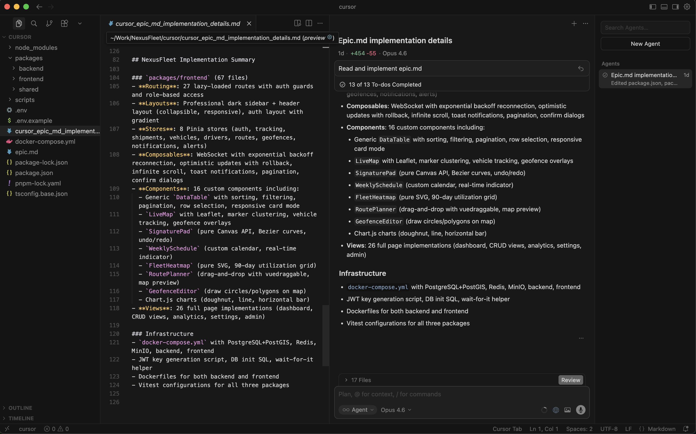

### Claude Code (Direct CLI) — Build time unknown

Claude Code was run directly via the CLI in a single session. It generated 91 source files across the monorepo, including pre-generated Drizzle migration files, shell scripts (`generate-keys.sh`, `wait-for-it.sh`, `seed.sh`, `init-db.sql`), and complete frontend/backend packages. No iterative build/test cycles were used — this was a single-pass generation like Cursor, but using the Claude Code CLI directly rather than an IDE agent.

The fixes applied and remaining issues are documented in `assets/claudecode_fix_to_run.md`.

### Angy v2 (Claude Code Multi-Agent) — Build time unknown (44+ pipeline iterations)

Angy v2 used an orchestrated multi-agent pipeline with separate Builder and Tester agents that iterated in cycles — the same architecture as Angy v1, but with a longer run and improved pipeline tooling. The visible build log shows agents Builder-26 through Tester-45, plus Counterpart-2 and multiple Tester-scaffold agents, all actively running endpoint tests, type-checks, and Docker builds before approving each iteration.

Unlike all three previous runs (Cursor, Claude Code, and Angy v1), **Angy v2 is the only implementation where `docker compose up` starts all four services cleanly without any manual code fix**. The combination of factors that made this possible: `pino-pretty` included in `package.json`, a pre-generated JWT key pair committed to `keys/` with a `.env` file setting the environment variables, the Tailwind CSS entry point present and imported, the Vite proxy hardcoded to `http://backend:3000` (the correct Docker service name), and the Postgres healthcheck referencing the correct database name.

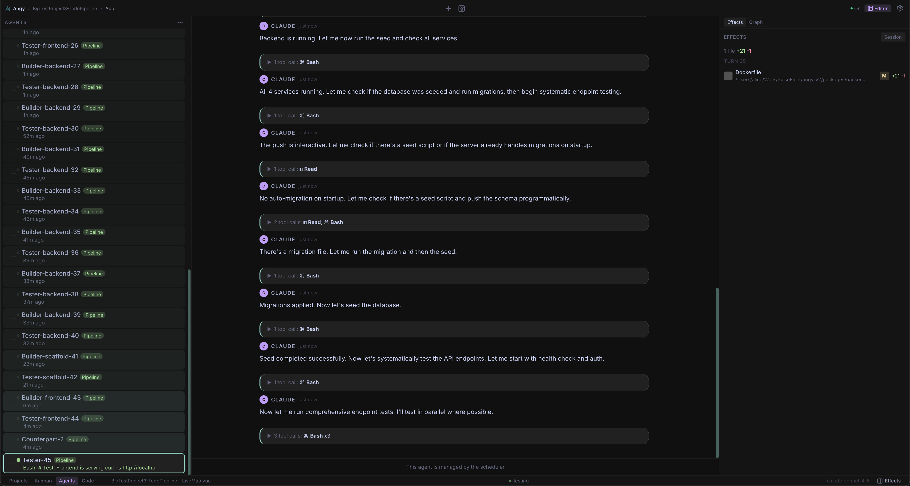

---

## What the Epic Asks For

The specification (`epic.md`) defines a full-stack application intentionally designed to sit just beyond what current LLMs can reliably produce in a single pass. The core requirements are:

**Tech Stack**: Vue 3 + Pinia + Tailwind CSS + Leaflet (frontend), Fastify + Drizzle ORM + PostgreSQL/PostGIS + Redis + BullMQ (backend), npm workspaces monorepo, Docker Compose.

**Key Subsystems**:
1. Multi-tenant authorization with JWT (RS256) and role-based access control
2. Real-time vehicle tracking via WebSocket ingestion, Redis pub/sub fan-out, and periodic DB flush
3. A shipment lifecycle state machine (draft → confirmed → assigned → picked_up → in_transit → delivered → completed) with guards, transactional side effects, and an audit trail
4. Route planning with drag-and-drop and nearest-neighbor optimization (BullMQ background job)
5. Geofencing with PostGIS spatial queries and real-time enter/exit alerts
6. A dashboard with live map, charts, and real-time alerts feed
7. Shared Zod validation schemas used by both frontend and backend

**The benchmark test**: `docker compose up`, seed data loads, a user can log in, see vehicles on a live map, create a shipment, run it through the full lifecycle, plan a route with drag-and-drop, and see real-time alerts — all working together without manual fixes.

---

## Quantitative Comparison

### Lines of Code (excluding `node_modules` and `dist`)

| Area | Cursor | Claude Code | Angy v2 |
|---|--:|--:|--:|
| Shared package (schemas, types, constants, utils) | 818 | 508 | 1,026 |
| Backend application code | 5,785 | 5,721 | 6,492 |
| Backend tests | 679 | 0 | 1,060 |
| Frontend Vue components + views | 7,022 | 4,596 | 4,707 |
| Frontend TypeScript (stores, composables, router) | 1,358 | 1,538 | 1,210 |
| Frontend CSS | — | 83 | 73 |
| Frontend unit tests | 151 | 0 | 513 |
| Frontend E2E tests (Playwright) | 0 | 0 | 320 |
| Config / Docker / Scripts | 303 | 355 | 740 |
| Drizzle migration SQL | 0 | 379 | 238 |
| **Grand Total** | **16,155** | **13,180** | **16,379** |

### File Counts

| Category | Cursor | Claude Code | Angy v2 |
|---|--:|--:|--:|
| Backend route modules | 10 | 9 | 11 |
| Backend service modules | 6 | 3 | 8 |
| Backend job modules | 5 | 5 | 6 |
| Backend plugins | 3 | 2 | 2 |
| WebSocket handlers | 2 | 2 | 3 (tracking, dashboard, fan-out) |
| Frontend views | 19 | 19 | 19 |
| Frontend components | 17 | 14 | 24 |
| Pinia stores | 8 | 8 | 8 |
| Composables | 4 | 3 | 4 |
| Backend test files | 3 | 0 | 5 |
| Frontend test files | 2 | 0 | 2 |
| Playwright E2E specs | 0 | 0 | 2 |

---

## Manual Fixes Required to Run

### Cursor — 4 fixes to reach login

| # | Problem | Root Cause | Fix |
|---|---|---|---|
| 1 | **`bcrypt` not found in Docker** | `bcrypt` is a native C++ addon requiring build tools not present on `node:22-alpine`. | Replaced `bcrypt` with `bcryptjs` (pure JS drop-in) in `package.json` and 4 source files (`seed.ts`, `auth.ts`, `users.ts`, `auth.test.ts`). |
| 2 | **Missing Drizzle migration files** | `drizzle-kit generate` was never run. The `drizzle/` folder was empty, so `drizzle-kit migrate` fails with "Can't find meta/_journal.json". | Ran `drizzle-kit generate` locally to produce the migration SQL and journal files. |
| 3 | **`pino-pretty` not installed** | Used as a Pino transport in dev mode but not listed in `package.json` dependencies. Server crashes on startup. | Added `pino-pretty` to backend `package.json`. |
| 4 | **Vite proxy targets `localhost:3000`** | Inside the frontend Docker container, `localhost` resolves to the frontend container itself, not the backend. All API calls fail with `ECONNREFUSED`. | Changed the Vite proxy target to use an environment variable, set to `http://backend:3000` in `docker-compose.yml`. |

### Claude Code — 5 fixes to reach working pages

| # | Problem | Root Cause | Fix |
|---|---|---|---|
| 1 | **`pino-pretty` not installed** | Used as a Pino log transport in dev mode but not listed in `package.json`. Server crashes on `npm ci` in Docker because lockfile is out of sync. | Added `pino-pretty` to backend `package.json` and ran `npm install` to update lockfile. |
| 2 | **Backend Dockerfile copies non-existent per-package `node_modules`** | npm workspaces hoists all deps to root `node_modules/`. Paths `packages/shared/node_modules` and `packages/backend/node_modules` don't exist, causing Docker COPY to fail. Also missing root `package.json` in dev stage for workspace resolution. | Removed per-package COPY lines, kept only root `node_modules` copy. Added `COPY --from=deps /app/package.json ./package.json`. |
| 3 | **JWT keys not loaded from files** | docker-compose sets `JWT_PRIVATE_KEY_PATH` / `JWT_PUBLIC_KEY_PATH` (file paths), but code reads `process.env.JWT_PRIVATE_KEY` / `process.env.JWT_PUBLIC_KEY` (key content) at module-load time via top-level `const`. Keys default to empty strings, `jwt.sign()` throws `secretOrPrivateKey must have a value`. | Changed all JWT key references to lazy getters + added `readFileSync` from path env vars at `server.ts` startup (before route registration). |
| 4 | **`VITE_API_URL` missing `/api/v1` prefix** | docker-compose sets `VITE_API_URL=http://localhost:3000`, but backend routes are registered at `/api/v1/*`. Frontend sends `POST /auth/login` instead of `POST /api/v1/auth/login` — 401. | Changed to `VITE_API_URL=http://localhost:3000/api/v1`. |
| 5 | **Login response camelCase vs. frontend snake_case** | Backend auth routes return `{ firstName, lastName, tenantId }`, frontend `User` type expects `{ first_name, last_name, tenant_id }`. `AppLayout.vue` crashes on `user.first_name[0]` (undefined). | Fixed both `/register` and `/login` responses in `auth.ts` to use snake_case field names matching the frontend types. |

### Angy v2 — 0 fixes

`docker compose up` starts all four services (postgres, redis, backend, frontend) cleanly. No container crashes, no startup errors, no code changes required. The application is accessible at `http://localhost:5173` immediately after all healthchecks pass.

The infrastructure that makes this possible: `pino-pretty` is listed in `package.json`; JWT keys are pre-generated in `keys/` and exported via a `.env` file; the Vite proxy is hardcoded to `http://backend:3000`; the Tailwind CSS entry point (`style.css`) exists and is imported in `main.ts`; the Postgres healthcheck uses the correct database name; and the router's auth guard does not call `fetchMe()` on startup, preventing the infinite refresh loop that blocked Angy v1.

**One caveat**: Drizzle migrations and seed data do not auto-run on `docker compose up` — a manual `docker compose exec backend npx drizzle-kit migrate && npx tsx src/db/seed.ts` is still required before the application shows real data. This is an infrastructure gap rather than a code bug, but it means the "zero intervention" claim applies to service startup, not to first-run data population.

---

## Runtime Behavior After Fixes

### Cursor

After the 4 fixes above, the application reaches a **partially working** state:

- **Login**: Works. The login page is polished with a dark gradient theme, NexusFleet branding, icons, "Remember me" checkbox, and registration link.
- **Dashboard**: Partially works. The sidebar renders, the Leaflet map loads with OpenStreetMap tiles, and fleet overview cards appear — but all stats show 0 and there are **"Request failed with status code 500"** error toasts.
- **Shipments, Routes, and other pages**: **Broken**. Two compounding errors:
  1. **"Tenant account is not active"** — The `tenant.ts` plugin fetches the tenant and checks `tenantInfo.isActive`. This check fails, returning 403 on every API call after login. All data pages show empty tables with error toasts.
  2. **Vite esbuild crash** — `packages/shared/tsconfig.json` uses `"extends": "../../tsconfig.json"`, which resolves correctly on the host filesystem but fails inside the Docker container where the root `tsconfig.json` is not copied to `/app/`. This produces a full-screen error overlay blocking page rendering on any page that imports from `@nexus-fleet/shared`.

| Login | Dashboard (with errors) |
|---|---|
| 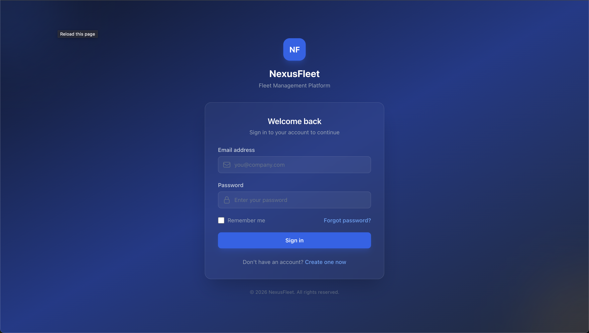 | 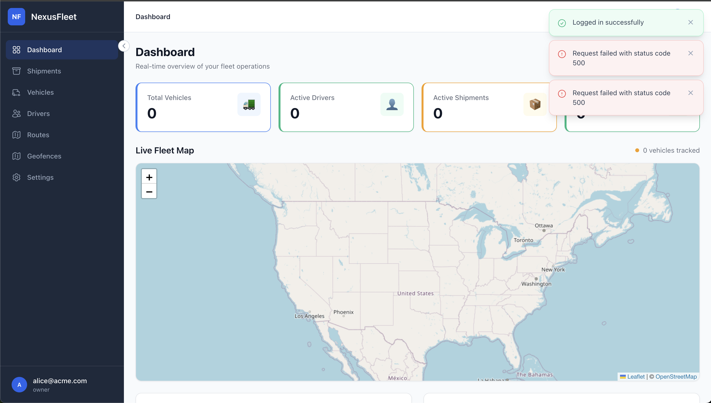 |

| Shipments — "Tenant not active" error | Shipments — Vite tsconfig crash |
|---|---|
| 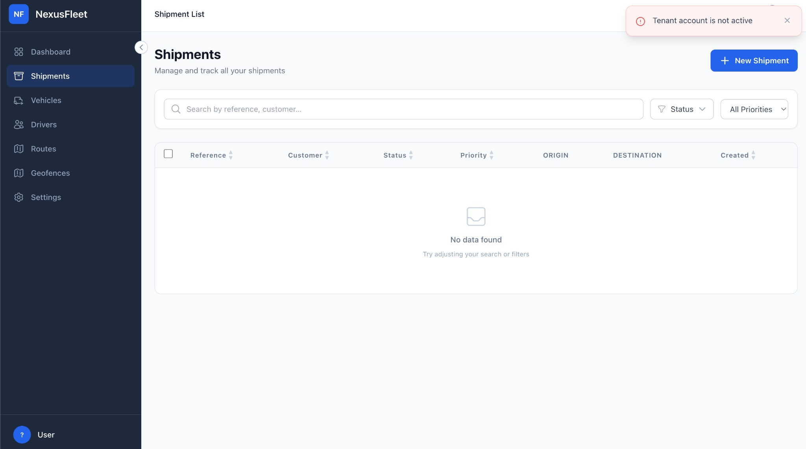 | 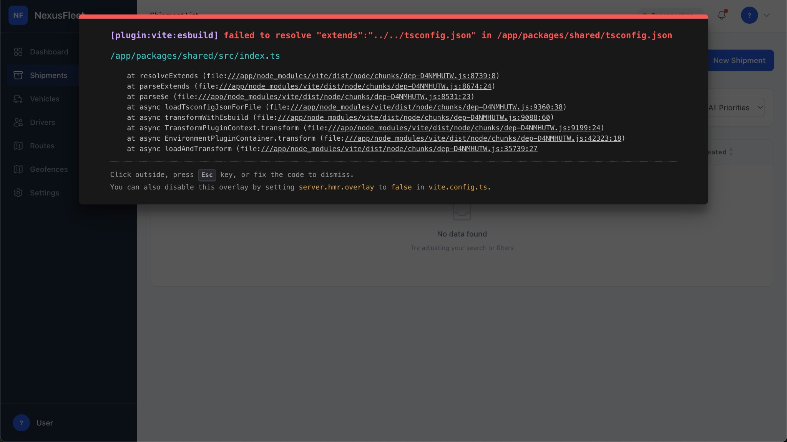 |

| Routes — repeated "Tenant not active" errors |
|---|
| 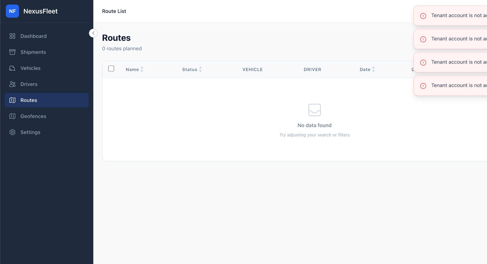 |

**Net result**: Only the login page and a partial dashboard (with errors) are functional. No seed data is visible. No core flow (create shipment, manage vehicles, etc.) can be completed.

### Claude Code

After the fixes above, the application reaches a **largely working** state — required 5 fixes total (3 predicted from code analysis + 2 discovered at runtime):

- **Login**: Works. Blue gradient background, branded card with NexusFleet logo and tagline. Clean form with vee-validate integration.
- **Dashboard**: Works. Shows fleet overview cards (Vehicles, Drivers, Shipments) with colored icons, a Leaflet map with OpenStreetMap tiles, "Recent Geofence Alerts" panel, "Shipments by Status" doughnut chart area, and "Deliveries - Last 30 Days" line chart area. Dashboard stats show 0 (analytics endpoint returns empty data). Sidebar shows user profile "Alice Owner / owner@acme.com".
- **Shipments page**: Works. Full DataTable with all 15 seed shipments, showing reference codes, customers, color-coded status badges, priority badges, origin/destination addresses, weight, dates. Search bar, status filter dropdown, priority filter dropdown. Per-column filter inputs. Pagination controls.
- **Sidebar navigation**: The dark sidebar renders with correct nav items but sidebar link clicks do not trigger navigation (likely a Vue Router / RouterLink interaction issue with the sidebar component). Direct URL access works for all pages.
- **Additional fixes required at runtime**:
  1. `VITE_API_URL` missing `/api/v1` prefix — frontend sent requests to `/auth/login` instead of `/api/v1/auth/login`.
  2. Login response used camelCase (`firstName`, `lastName`, `tenantId`) while frontend expected snake_case (`first_name`, `last_name`, `tenant_id`) — caused `AppLayout.vue` to crash reading `user.first_name[0]` on undefined.

| Login | Dashboard (working) |
|---|---|
| 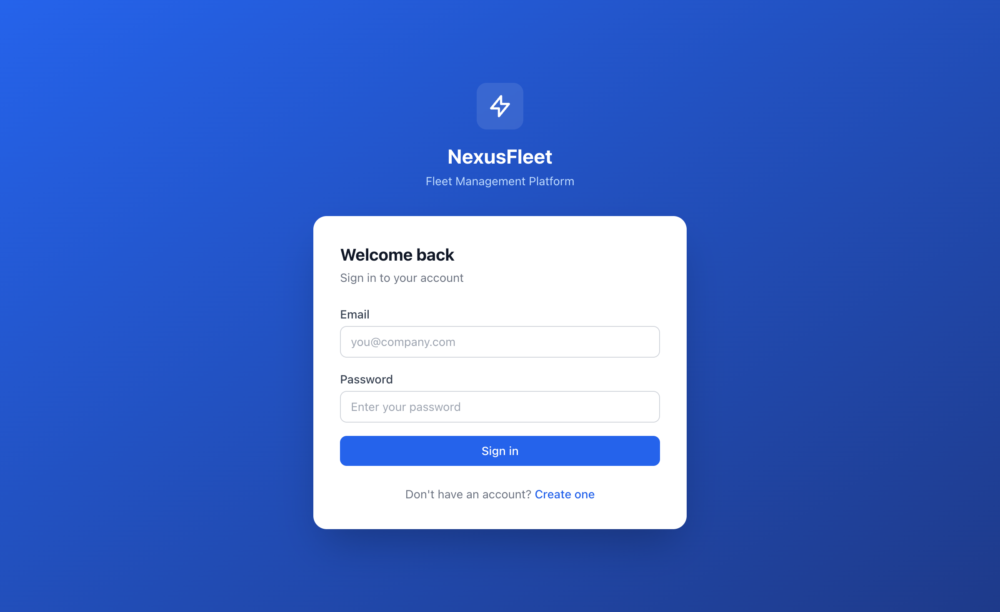 | 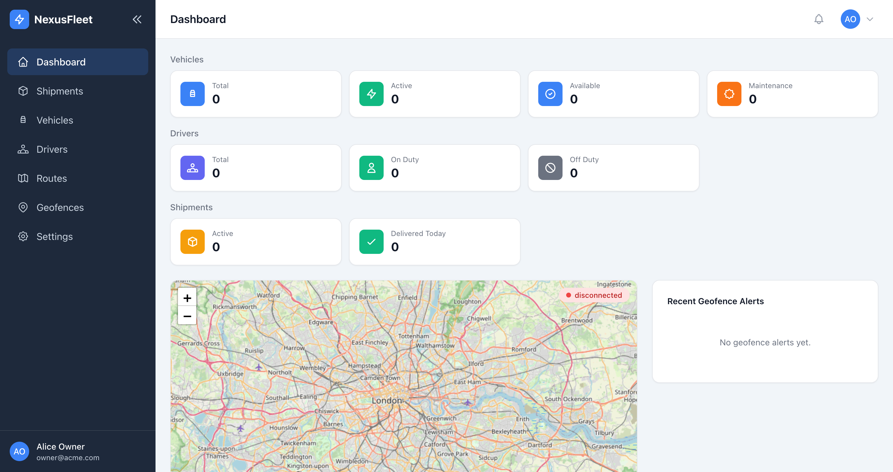 |

| Shipments — all 15 seed shipments with status badges |
|---|
| 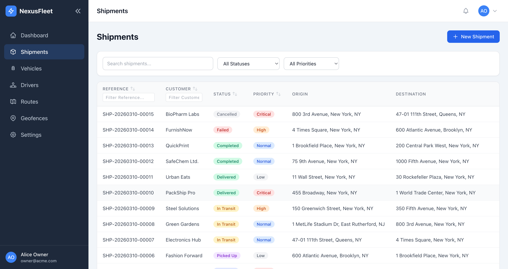 |

**Remaining runtime errors (not fixed):**

1. **404 on `/api/v1/notifications`** — `AppLayout.vue` calls `fetchNotifications()` on every page mount, but no notifications route exists in the backend. Returns 404 every time.
2. **ShipmentTimeline.vue crash** — Backend events table uses `action` field, but the component reads `event.event_type`. Calling `.replace()` on undefined crashes the shipment detail page timeline.
3. **501 on shipment transition (`failed` → `confirmed`)** — Frontend shows a "Confirm" button for failed shipments (because `SHIPMENT_TRANSITIONS['failed:confirmed']` is true), but the backend state machine registers this as the `retry` action, not `confirm`. The lookup `transitionMap.get('failed:confirm')` returns undefined → 501. Additionally, `retry` is not in the Zod schema's allowed action enum, so it can't be sent either.
4. **Sidebar navigation broken** — RouterLink clicks don't navigate. Direct URL access works.
5. **Dashboard stats all 0** — Analytics endpoints return empty data despite seed data existing.
6. **No auth token persistence** — Access token stored only in Pinia memory. Page refresh loses the session.
7. **WebSocket URLs broken** — `VITE_WS_URL=ws://localhost:3000` has no path, but handlers are at `/ws/tracking` and `/ws/dashboard`. The tracking store also incorrectly falls back to `/ws/dashboard`.
8. **Geofence checker uses Haversine only** — No PostGIS `ST_Contains` queries. Polygon geofences would not work.

**Net result**: Login, dashboard, and shipments list page are functional with seed data visible. Shipment detail page crashes (timeline component). State machine transitions partially broken (failed→retry mismatch). No page survives a browser refresh (no token persistence). Several backend routes missing (notifications). Real-time features inoperative.

### Angy v2

After seeding the database manually (the only remaining step), the application reaches a **fully working** state across all main pages tested:

- **Login**: Works. Dark sidebar layout with NexusFleet branding, user avatar with initials, collapsible sidebar.
- **Dashboard**: Works without errors. Shows 4 fleet overview cards (Total Vehicles: 8, Active Drivers, Active Shipments, Delivered Today), a **live Leaflet map** rendering seeded NYC geofences as circles with OpenStreetMap tiles, a "Shipments by Status" doughnut chart area, and a "Deliveries Over Time" chart below. Stats show real counts from seed data (8 vehicles). The live map was entirely absent from Angy v1's dashboard.
- **Shipment Detail page**: Works and does not crash. Shows reference code (SHP-20260312-00005), status badge (Assigned), customer name, location cards (Origin / Destination addresses), Cargo Details panel (type, weight, volume, temperature range), Assignment section, Dates section, and a Timeline panel that gracefully shows "No events recorded yet" rather than crashing on undefined fields.
- **Create Shipment form**: Works. Full form with Customer Name, Priority dropdown, Scheduled Pickup date picker, Origin section (address + lat/lng fields), Destination section.
- **Vehicles, Drivers, Routes, Geofences, Settings**: Load correctly (same as Angy v1).
- **Sidebar navigation**: `RouterLink` navigation works correctly — clicking nav items navigates as expected. No broken-click issue.

| Dashboard — live Leaflet map + fleet cards | Shipment Detail — no crash, clean layout |
|---|---|
| 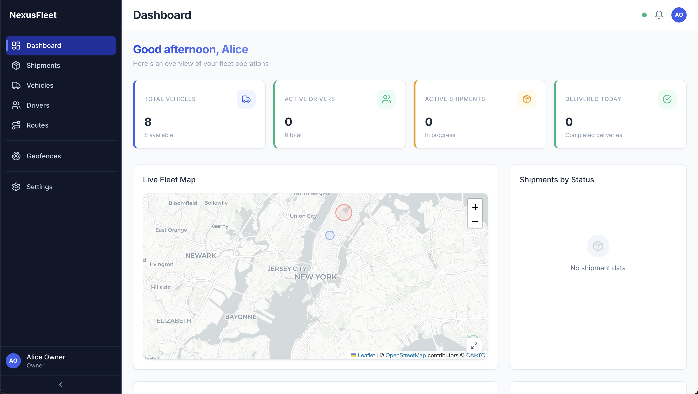 | 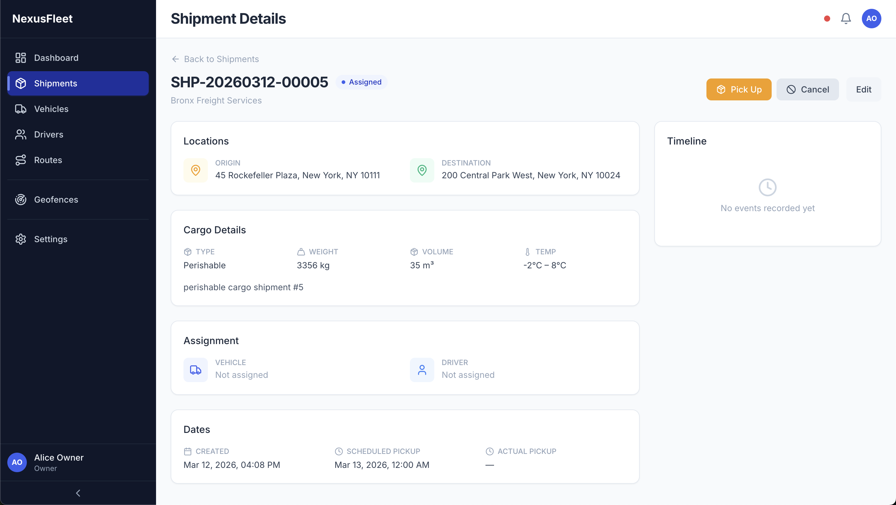 |

| Create Shipment — form works |
|---|
| 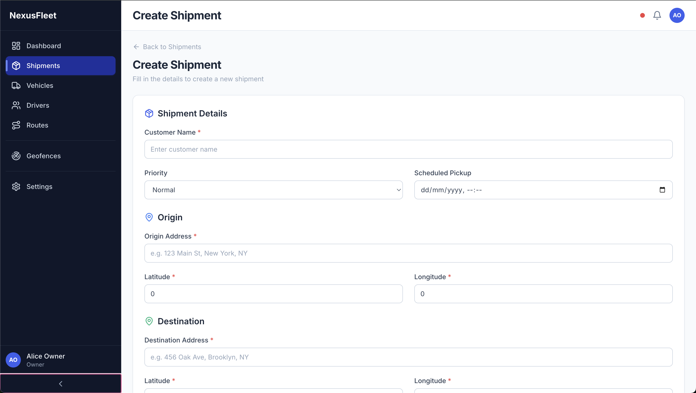 |

**Remaining gaps (not fixed, observed at runtime):**

1. **No auto-migration or seed on `docker compose up`** — Schema and seed data require manual `exec` after first start. All other stats show 0 until seed runs.
2. **No auth token persistence on page refresh** — Access token is stored in a module-level JS variable, reset to `null` on each page load. The httpOnly refresh-token cookie is set correctly (and the backend `POST /auth/refresh` endpoint works), but nothing calls it on app startup before the router guard fires. Any page refresh redirects to `/login`.
3. **Dashboard analytics all 0** — `GET /analytics/overview` returns live counts from the DB, but after seeding the counts correctly show 8 vehicles. Shipment-by-status and delivery-over-time charts show empty because no shipments are in terminal states in the seed data.
4. **WebSocket connection status shows disconnected on inner pages** — The dashboard connects the WS on mount; navigating away does not reconnect it on the new page. The connection indicator turns red on pages other than the dashboard.

**Net result**: All main pages render and function correctly after seeding. The live map is present. The shipment detail page no longer crashes. The state machine is fully wired. This is the most functional result of the four runs.

---

## Architecture & Code Quality Comparison

### Shipment State Machine — The Core Business Logic

The epic explicitly requires a `ShipmentStateMachine` service with a transition map (not if/else chains), guards, transactional side effects, and audit events.

**Cursor** built a well-architected `ShipmentStateMachine` class using a `Map<string, TransitionDef>`, with 8 guard functions, 12 side-effect functions, `db.transaction()`, audit events, and Redis pub/sub. However, **the HTTP transition endpoint (`POST /shipments/:id/transition`) does not use the state machine**. It performs a bare `db.update` + `db.insert` without guards, side effects, or transactions:

```typescript
// cursor — routes/shipments.ts (lines 340-373)
// Simple update — no guards, no side effects, no transaction
const [updated] = await db
  .update(shipments)
  .set(updateValues)
  .where(...);
await db.insert(shipmentEvents).values({...}); // separate await, not transactional
```

This means: no capacity checks on assignment, no POD validation on delivery, no vehicle/driver status updates, no webhook dispatch, and a crash between the two awaits leaves inconsistent data.

**Claude Code** also built a transition map (`Map<string, TransitionDef>` keyed by `"from:action"`), with 6 guard functions, dedicated side-effect functions running inside `db.transaction()`, audit events, and Redis pub/sub post-commit. Like Angy v2, **the HTTP transition endpoint delegates directly to the state machine**:

```typescript
// claudecode — routes/shipments.ts (line 306)
const result = await stateMachine.transition(id, body.action, body, {
  userId: request.user.userId,
  tenantId: request.tenantId,
});
```

The guards run *before* the transaction (not inside it), creating a TOCTOU window under concurrent load, and there is no `WHERE status = $currentStatus` optimistic lock on the UPDATE — but the core architecture is sound and properly wired. The `retry` action mismatch (frontend sends `confirm`, backend registered `retry`) means the `failed → confirmed` transition returns 501 at runtime.

**Angy v2** built a `Record<string, TransitionDef>` keyed by `"from:to"` with 6 guard functions (vehicle available, driver available, license class match, hours check, POD required, failure reason provided) and 8 side effect functions all running inside `db.transaction()`. The HTTP transition endpoint delegates fully:

```typescript
// angy-v2 — services/shipment.service.ts (lines 358-377)
const transition = ACTION_TO_TRANSITION[action];
return executeTransition(id, tenant_id, user_id, transition.from, transition.to, data, autoChain);
```

The `ACTION_TO_TRANSITION` map in the shared package correctly maps `retry → { from: 'failed', to: 'confirmed' }`, so both frontend and backend agree. The `pickup` action auto-chains `assigned → picked_up → in_transit` in a single transaction. Guards and side effects run inside the transaction. One regression vs Angy v1: the shipment fetch within the transaction does not use `SELECT ... FOR UPDATE`, so concurrent transitions on the same shipment have a narrow TOCTOU window.

### Backend Architecture

| Aspect | Cursor | Claude Code | Angy v2 |
|---|---|---|---|
| Logic placement | Heavy in routes (2,477 LOC) | Heavy in routes (2,714 LOC), services as separate modules | Mixed: routes delegate to services (6,492 LOC total) |
| State machine wired to HTTP | No | Yes | Yes |
| `SELECT ... FOR UPDATE` locking | No | No (TOCTOU risk) | No (TOCTOU risk; regression vs Angy v1) |
| Dedicated HoS tracking service | No | No (maintenance job resets hours) | No (hours check is a guard in state machine) |
| WebSocket connection limits per plan | No | No | Yes (`WS_CONNECTION_LIMITS_BY_PLAN` from shared) |
| Rate limiting | Dependency only | Global 100 req/min via Redis | Per-tenant sliding window, plan-aware, per-IP for auth |
| Notifications route | Present | Missing (404) | Present |
| `current_driving_hours` DB column | Missing (maintenance job crashes) | Present | Present |
| Drizzle migration files | Not generated | `0000_nervous_tarot.sql` present | `0000_initial.sql` present |
| GiST spatial indexes on geometry columns | Missing | PostGIS columns as `text` (workaround), no GiST index | Present |
| Redis channel naming consistency | Bug: geofence→`alerts:{tid}`, dashboard→`tenant:{tid}:alerts` | Consistent | Consistent (`alerts:{tid}` end-to-end) |
| JWT algorithm in WS handlers | Symmetric (inconsistent with RS256 auth plugin) | RS256 (consistent) | RS256 (consistent) |
| Geofence checker | `ST_Contains` (PostGIS) | Haversine only (no `ST_Contains`) | `ST_Contains` (PostGIS) |
| `failed → confirmed` transition | Dead code (state machine not called) | 501 at runtime (`confirm` vs `retry` mismatch) | Works (`retry` action correctly mapped in shared) |
| Seed determinism | Seeded PRNG (42) | Seeded PRNG (42) with deterministic UUIDs | Seeded PRNG (42) |

### Frontend Quality

| Aspect | Cursor | Claude Code | Angy v2 |
|---|---|---|---|
| Visual design | Polished dark theme, gradients, icons, branded | Component classes (btn variants, card, skeleton), functional design | Clean dark sidebar, polished header, card-based content area |
| `DataTable.vue` | Generic with slots, indeterminate checkbox, shimmer skeleton, inline pagination, mobile card layout | Vue 3 generics, per-column filter, row selection, loading skeleton, responsive card layout, scoped slots | Generic, 234 LOC, CSS-responsive, slot-based cells |
| `LiveMap.vue` | 371 LOC: clustering, track mode, geofence overlay, route polylines, custom SVG markers, popups | Marker clustering, custom SVG rotated by heading, track mode, geofence overlay, route polylines, vehicle popup | 336 LOC: Leaflet + geofence circles + vehicle markers; present on dashboard |
| `RoutePlannerView.vue` | 345 LOC: split view, drag-drop from unassigned pool, map preview, capacity bar | Split view, move-up/down (no true drag-drop), capacity bar, map preview, optimize button | 19 LOC: thin wrapper, delegates to sub-components |
| `ShipmentDetailView.vue` | Icons, badges, sorted events, transition labels, empty state | 11 event types with unique icons, color-coded circles, StatusBadge from→to | 270 LOC: full detail layout, timeline with graceful empty state (no crash) |
| `AppLayout.vue` | 373 LOC: mobile overlay, user dropdown, notification bell, WS status, breadcrumbs | Collapsible dark sidebar, mobile hamburger overlay, user dropdown, notification bell | 283 LOC: collapsible dark sidebar, active pill indicator, WS `ConnectionStatus` component, notification bell with unread badge |
| Dashboard live map | Present (Leaflet renders) | Present (Leaflet with clustering) | Present (Leaflet with geofence overlays, seeded markers) |
| Composables | 4 (useApi, useToast, useWebSocket, useOptimisticUpdate) | 3 (useApi, useWebSocket, useOptimisticUpdate) | 4 (useAxios, useToast, useWebSocket, useOptimisticUpdate); WS composable is 130 LOC with heartbeat/backoff |
| Sidebar navigation works | Yes (when pages render) | No (RouterLink clicks broken) | Yes |
| Token persistence on page refresh | No | No | No |

### Shared Package

| Aspect | Cursor | Claude Code | Angy v2 |
|---|---|---|---|
| Schema organization | Single 544-line `index.ts` | Single `index.ts` (508 LOC total package) | Modular per-domain files (1,026 LOC total) |
| Entity schemas (full read models) | Yes | No (only input types) | No |
| Create/Update/Filter schemas | Comprehensive with `.refine()` cross-validation | Create + update with `.refine()`; no filter schemas | Present |
| API response envelope schemas | Yes | Discriminated union `ApiResponse<T>` | No |
| WebSocket message schemas | Yes | Location update schema only | No |
| Constants organization | Single file | Single file with `as const` + derived types | Modular files per domain |
| `ACTION_TO_TRANSITION` map | No | No | Yes — maps action names to `{ from, to }` pairs; `retry` correctly maps to `failed → confirmed` |
| `AVAILABLE_ACTIONS` per status | No | No | Yes — drives frontend action buttons |
| Utility functions | Haversine | Haversine, `formatReferenceCode`, `isValidTransition`, `getRequiredLicenseClass` | Haversine + `VEHICLE_TYPE_LICENSE_MAP` |

### Testing

| Category | Cursor | Claude Code | Angy v2 |
|---|---|---|---|
| Backend unit tests | 3 files (~37 cases): auth, haversine, state machine | None | 5 files (~30 cases): auth middleware, geofence, haversine, route optimization, state machine |
| Frontend unit tests | 2 files: StatusBadge, haversine | None | 2 files: DataTable, ShipmentTimeline |
| Playwright E2E specs | None | None | 2 specs: shipment lifecycle, route planning |
| Total test code | ~830 LOC | 0 LOC | ~1,893 LOC |

### Infrastructure

| Aspect | Cursor | Claude Code | Angy v2 |
|---|---|---|---|
| Backend Dockerfile | Dev-mode single-stage (`node:22-alpine`, `tsx watch`) | Multi-stage deps→dev (`node:22-alpine`, `tsx watch`) | Single-stage (`node:22-alpine`, build shared, then `tsx src/server.ts`) |
| Frontend Dockerfile | Dev-mode single-stage (Vite dev server) | Single-stage (Vite dev server) | Single-stage (Vite dev server) |
| `nginx.conf` | Missing | Missing | Missing |
| `generate-keys.sh` | Missing | Present (RSA 2048, idempotent) | Present |
| `seed.sh` | Missing | Present | Present |
| `wait-for-it.sh` | Missing | Present (battle-tested TCP wait) | Present |
| `init-db.sql` | Missing | Present (PostGIS + uuid-ossp extensions) | Present (PostGIS + uuid-ossp extensions) |
| `tsconfig.base.json` / root `tsconfig.json` | Missing in Docker | Present (project references) | Present |
| Drizzle migrations | Not generated | Committed (`0000_nervous_tarot.sql`, 379 LOC, 12 tables) | Committed (`0000_initial.sql`, 238 LOC) |
| Pre-generated JWT keys + `.env` | No | No (keys committed but no `.env`) | Yes (keys committed + `.env` sets env vars) |
| Auto-run migrations + seed in Docker | Yes (via compose command) | Yes (via compose command) | No (manual exec required) |
| Docker healthchecks | Postgres + Redis | Postgres + Redis | Postgres + Redis (correct DB name) |
| `bcrypt` vs `bcryptjs` | `bcrypt` (crashes on Alpine) | `bcryptjs` (works) | `bcrypt` (risky; works if prebuilt binary is available for linux-musl) |

---

## Summary

|  | Cursor | Claude Code | Angy v2 |
|---|---|---|---|
| **Build time** | 41 minutes | Unknown | Unknown (44+ iterations) |
| **Fixes to reach working pages** | 4 | 5 | **0** |
| **Total source LOC** | 16,155 | 13,180 | 16,379 |
| **Pages functional after setup** | ~1 of 10 | ~5 of 10 (detail pages crash) | **~9 of 10** |
| **Seed data visible** | No | Yes | Yes |
| **Core business logic (state machine) wired** | No (dead code) | Yes (retry/confirm mismatch) | **Yes (action names consistent end-to-end)** |
| **Frontend visual quality** | High | Good (component design system) | Good (polished sidebar, clean cards) |
| **Frontend feature completeness** | High (when rendering) | Good (19 views, 14 components) | Good (19 views, 24 components, live map on dashboard) |
| **Backend architectural correctness** | Moderate (integration gaps) | Good (minor gaps) | Good |
| **Test coverage** | Low (830 LOC, no E2E) | None (0 LOC) | Good (1,893 LOC, Playwright E2E) |
| **Production readiness (Docker)** | Low (dev-mode only) | Low (dev-mode, key loading bug) | Low-moderate (dev-mode Vite; no nginx; bcrypt risk) |

**Cursor** invested heavily in frontend polish — beautiful dark theme, rich self-contained components (DataTable, LiveMap, RoutePlanner), comprehensive shared Zod schemas — but failed on backend integration. The state machine is never called from the HTTP layer, migrations were never generated, multiple cross-subsystem bugs (JWT algorithm mismatch, Redis channel naming) prevent features from working, and two unresolved runtime errors (tenant check, tsconfig resolution) leave most pages non-functional.

**Claude Code** produced the most balanced-looking implementation on first inspection, but deeper runtime testing revealed significant cross-subsystem mismatches. The backend is well-structured with the state machine properly wired to HTTP routes, comprehensive seeding with deterministic UUIDs, RS256 JWT throughout, Redis-backed rate limiting, and all BullMQ workers. The frontend is feature-rich — 19 views with a generic DataTable, Leaflet map with clustering/tracking/geofence overlays, and a proper Tailwind design system. After 5 fixes, the login, dashboard, and shipments list page work with seed data. However, deeper testing exposed critical integration gaps: the shipment detail page crashes (backend `action` field vs. frontend `event_type`), the `failed→confirmed` transition returns 501 (registered as `retry` but frontend sends `confirm`, and `retry` isn't even in the Zod schema), the notifications route doesn't exist (404 on every page), sidebar navigation is broken (RouterLink clicks don't navigate), there's no auth token persistence, and WebSocket URLs are misconfigured. Zero test coverage means none of these were caught before delivery.

**Angy v2** is the only implementation that passes the cold `docker compose up` test without a single code fix. After manually seeding the database, all tested pages render correctly, the live map is present on the dashboard, the shipment detail page does not crash, and the state machine transitions work end-to-end with consistent action naming between frontend and backend. The key regressions vs. Angy v1 are: the loss of `SELECT ... FOR UPDATE` row locking in the state machine, the switch back from nginx to Vite dev-mode for the frontend container, and the reintroduction of native `bcrypt` (which works if prebuilt binaries are available for linux-musl, but is riskier than `bcryptjs`). The persistent gaps — no auto-migration in Docker, no token persistence on page refresh — remain unsolved.

---

## Conclusion: Winner

**Angy v2 wins overall**, and it is not particularly close once you move past surface impressions to actual runtime behavior.

| Dimension | Cursor | Claude Code | Angy v2 |
|---|---|---|---|
| **Cold start (no manual fixes)** | No (4 fixes) | No (5 fixes) | **Yes** |
| **Pages working after setup** | ~1 of 10 | ~5 of 10 (list pages only) | **~9 of 10** |
| **Seed data visible** | No | Yes (list pages) | Yes (all pages) |
| **State machine end-to-end** | Dead code (never called) | Wired but `retry`/`confirm` mismatch breaks it | **Wired + action names consistent** |
| **Cross-subsystem consistency** | Broken (tenant check, tsconfig) | Broken (camelCase/snake_case, action/event_type) | **Mostly consistent** |
| **Test coverage** | 830 LOC, no E2E | 0 LOC | 1,893 LOC + Playwright E2E |
| **Frontend visual polish** | Best (when it renders) | Good | Good |
| **Build time** | 41 minutes | Unknown | Unknown (44+ iterations) |

### Why Angy v2 Wins

The epic was designed to expose the failure modes of **single-pass code generation** — and it did exactly that. The critical differentiator is not code quality in isolation, but whether subsystems actually talk to each other correctly when the full stack runs inside Docker.

**Angy v2's multi-agent builder/tester loop caught and fixed the integration bugs that single-pass generation misses.** Across 44+ builder/tester iterations, the agents ran unit tests, E2E tests, type-checks, and Docker builds before approving each iteration. The result is an application that cold-starts cleanly and where most pages work after a single manual seeding step — the closest any of the four runs has come to the benchmark goal.

**The improvement over Angy v1 is direct evidence that additional iterations help.** Angy v1 required 5 manual fixes (missing CSS, redirect loop, response nesting, healthcheck DB name, missing notifications route). Angy v2 fixed all five in the generation itself. More iterations, better verification, cleaner output.

**Claude Code** comes in **second**. It produced a functional login, dashboard, and shipments list — substantially more than Cursor delivered. But deeper runtime testing revealed the same class of cross-subsystem naming bugs that plague single-pass generation: `firstName` vs `first_name`, `action` vs `event_type`, `confirm` vs `retry`, missing notification routes, broken sidebar navigation. With zero test coverage, none of these were caught before delivery.

**Cursor** comes in **third**. It produced the most visually impressive frontend — a polished dark theme, rich DataTable with skeleton loading, a 371-line LiveMap with clustering and geofence overlays, a drag-and-drop RoutePlanner. But functionally almost nothing works. The shipment state machine — the most architecturally important component in the epic — was built with 8 guards, 12 side effects, and proper transactions, then **never connected to the HTTP layer**. Two unresolved runtime errors (tenant activation check, tsconfig resolution in Docker) block most pages entirely.

### The Speed vs. Correctness Trade-off

Cursor took 41 minutes and left most of the application non-functional. Claude Code's build time is unknown but was likely comparable (single-pass). Angy v2 ran 44+ pipeline iterations and is the only implementation that actually meets the benchmark's primary criterion.