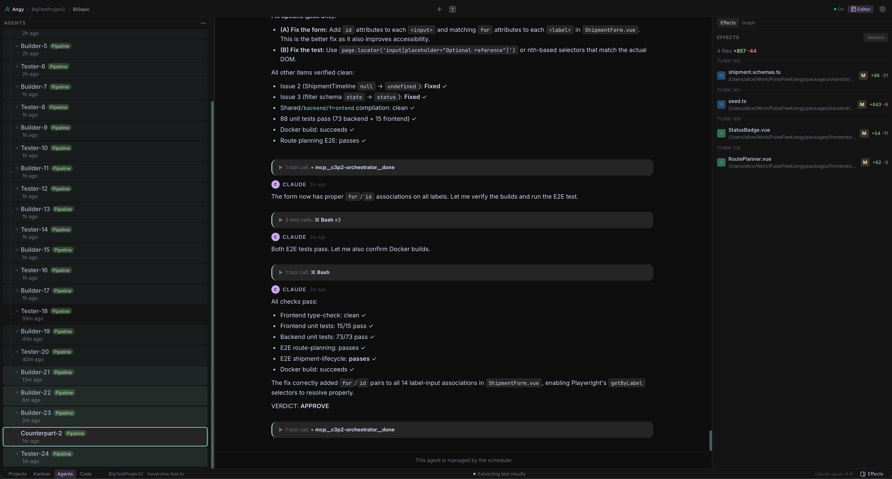
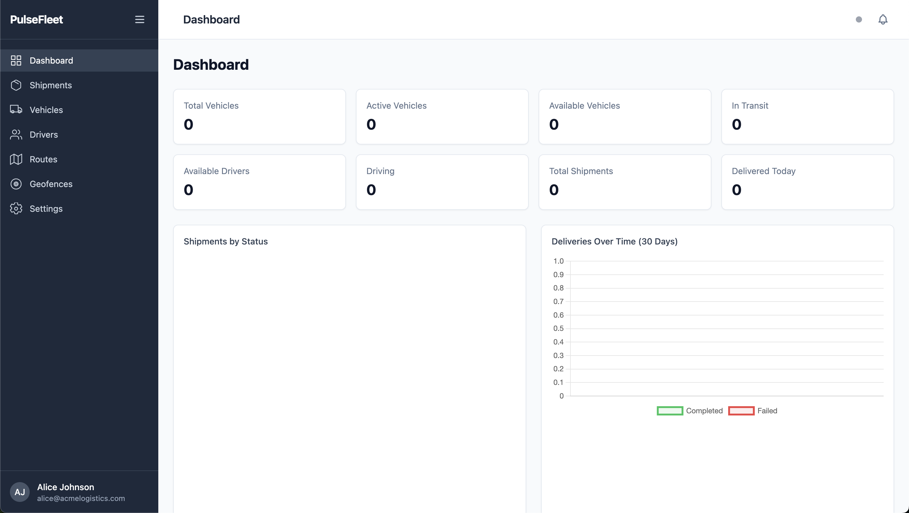
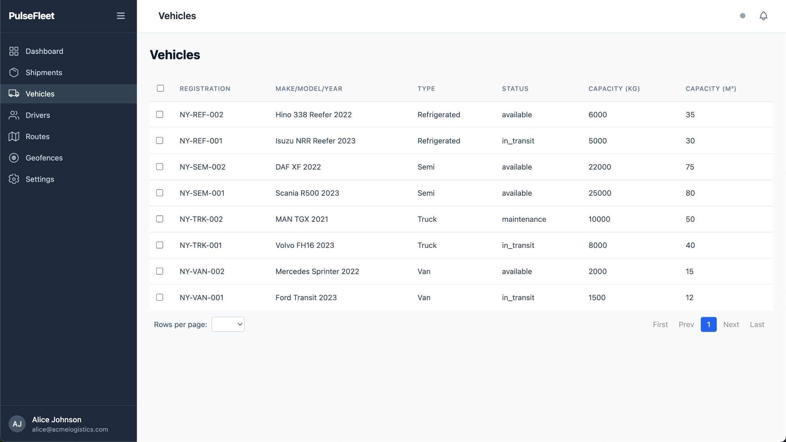
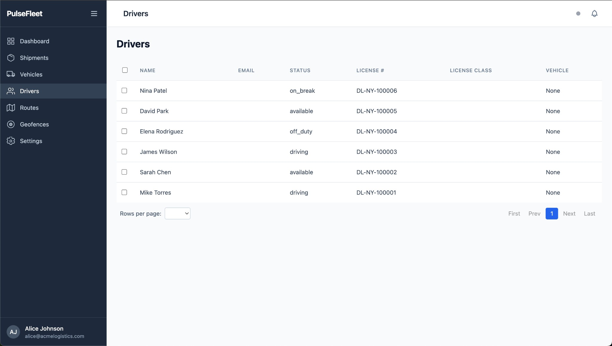
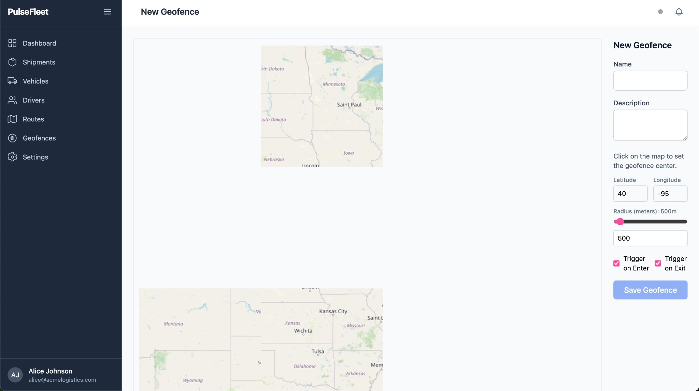

# NexusFleet — LLM Code Generation Benchmark

This repository contains two independent implementations of **NexusFleet**, a real-time multi-tenant fleet management platform, generated by two different LLM code generation agents:

- **`cursor/`** — Generated by Cursor
- **`angy/`** — Generated by Angy (who drives the Claude Code CLI agent)

Both agents were given the same specification (`epic.md`) and asked to produce a complete, working application from scratch.

## Why This Epic Is Hard

The specification is deliberately engineered to **expose the failure modes of single-pass code generation**. Most LLM coding benchmarks test isolated tasks — write a function, fix a bug, add a feature to an existing codebase. This epic is different: it requires building an entire interconnected system from zero, where correctness in one subsystem depends on correctness in several others.

### Interconnected Complexity

The 10 intentional complexity points from the epic are not independent — they form a dependency web:

- The **shipment state machine** touches 3 tables atomically (shipment, vehicle, driver). Getting the state transitions right means nothing if the transaction boundaries are wrong, and wrong transactions cascade into inconsistent data that breaks every downstream query and UI view.
- The **real-time tracking pipeline** flows through 3 consistency models: WebSocket (real-time), Redis (eventually consistent), and PostgreSQL (persistent). A naming mismatch in a single Redis channel key silently breaks the entire alert delivery chain from geofence check → dashboard notification.
- **Tenant isolation** must be enforced in every query, every cache key, every WebSocket channel, and every background job. One miss is a data leak. This is easy to get right in any single file, but maintaining it across 50+ source files without a single slip requires systemic discipline.
- **Shared Zod schemas** must work identically for Fastify request validation on the backend and VeeValidate form validation on the frontend. The schemas, the API response envelope, and the frontend's destructuring of responses must all agree — a mismatch at any layer means the data flows through but gets silently lost.

### The Single-Pass Problem

This is where the benchmark becomes revealing. An LLM generating code in a single pass (or even a few passes) faces a fundamental challenge: **it must hold the entire system's contract surface in context simultaneously**. When writing the shipment route handler, the model must remember the state machine's interface, the database schema's column names, the shared Zod schema's field names, the API response envelope structure, and the frontend store's expected response shape. A human developer would verify each integration point incrementally — write the service, test it, write the route, test it, wire the frontend, test it. A single-pass generator must get all of these right on the first try, or produce bugs that only manifest when the full stack runs together.

The epic's `docker compose up` benchmark is the ultimate integration test: it forces every subsystem to actually talk to every other subsystem, with real PostgreSQL, real Redis, real WebSocket connections, and real browser rendering. Code that "looks correct" in isolation — a beautifully architected state machine that is never called, a Tailwind config with no CSS entry point, an Axios interceptor that creates an infinite loop — fails immediately under this test.

### Scale of the Task

The specification spans ~1,100 lines and defines:
- 12 database tables with PostGIS geometry types, composite indexes, and cross-table constraints
- A 7-state finite automaton with 11 transitions, each with specific guards and side effects
- 4 BullMQ job queues with different concurrency, retry, and scheduling strategies
- 2 WebSocket protocols (vehicle ingestion + dashboard fan-out) with selective subscriptions
- ~25 API endpoints across 8 resource types with filtering, pagination, and role-based access
- ~20 frontend views with interactive components (drag-and-drop, live map, charts)
- Deterministic seed data (seeded RNG with value 42) for reproducible testing
- Docker Compose orchestration of 4 services with health checks and volume mounts

The total surface area is manageable for a human team working over weeks, but asks an LLM to produce ~15,000 lines of correctly integrated code in a single session — a task that requires sustained coherence across hundreds of cross-file contracts.

---

## Build Process

### Cursor — 41 minutes

Cursor used its Agent mode with the Opus 4.6 model. It worked through a 13-item to-do list in a single session, generating 122 source files across the monorepo in one continuous pass.


### Angy (Claude Code) — 2 hours 53 minutes

Angy used an orchestrated multi-agent pipeline with separate Builder and Tester agents that iterated in cycles. The process ran through approximately 24 builder/tester iterations (Builder-5 through Tester-24, plus a Counterpart-2 agent), where each Tester verified compilation, ran unit tests, E2E tests, and Docker builds before approving or sending back for fixes.

The final Tester-24 iteration reported all checks passing:
- Frontend type-check: clean
- Frontend unit tests: 15/15 pass
- Backend unit tests: 73/73 pass (later 88 total with smoke tests)
- E2E shipment-lifecycle: passes
- E2E route-planning: passes
- Docker build: succeeds
- **Verdict: APPROVE**

Angy's build was cut short at Tester-24 due to a Claude Code service outage (elevated errors and login issues reported on the Anthropic status page at 14:44 UTC on March 11, 2026). The build had passed all its own verification checks at that point, but this means no further refinement iterations were possible.



---

## What the Epic Asks For

The specification (`epic.md`) defines a full-stack application intentionally designed to sit just beyond what current LLMs can reliably produce in a single pass. The core requirements are:

**Tech Stack**: Vue 3 + Pinia + Tailwind CSS + Leaflet (frontend), Fastify + Drizzle ORM + PostgreSQL/PostGIS + Redis + BullMQ (backend), npm workspaces monorepo, Docker Compose.

**Key Subsystems**:
1. Multi-tenant authorization with JWT (RS256) and role-based access control
2. Real-time vehicle tracking via WebSocket ingestion, Redis pub/sub fan-out, and periodic DB flush
3. A shipment lifecycle state machine (draft → confirmed → assigned → picked_up → in_transit → delivered → completed) with guards, transactional side effects, and an audit trail
4. Route planning with drag-and-drop and nearest-neighbor optimization (BullMQ background job)
5. Geofencing with PostGIS spatial queries and real-time enter/exit alerts
6. A dashboard with live map, charts, and real-time alerts feed
7. Shared Zod validation schemas used by both frontend and backend

**The benchmark test**: `docker compose up`, seed data loads, a user can log in, see vehicles on a live map, create a shipment, run it through the full lifecycle, plan a route with drag-and-drop, and see real-time alerts — all working together without manual fixes.

---

## Quantitative Comparison

### Lines of Code (excluding `node_modules` and `dist`)

| Area | Cursor | Angy |
|---|--:|--:|
| Shared package (schemas, types, constants, utils) | 818 | 489 |
| Backend application code | 5,785 | 5,724 |
| Backend tests | 679 | 2,202 |
| Frontend Vue components + views | 7,022 | 3,473 |
| Frontend TypeScript (stores, composables, router) | 1,358 | 1,508 |
| Frontend unit tests | 151 | 235 |
| Frontend E2E tests (Playwright) | 0 | 486 |
| Config / Docker / Scripts | 303 | 358 |
| Drizzle migration SQL | 0 | 321 |
| **Grand Total** | **16,155** | **14,799** |

### File Counts

| Category | Cursor | Angy |
|---|--:|--:|
| Backend route modules | 10 | 10 |
| Backend service modules | 6 | 14 |
| Backend job modules | 5 | 5 |
| Backend plugins | 3 | 4 |
| WebSocket handlers | 2 | 2 (+connection limiter) |
| Frontend views | 19 | 22 |
| Frontend components | 17 | 24 |
| Pinia stores | 8 | 9 |
| Composables | 4 | 2 |
| Backend test files | 3 | 5 (+2 smoke tests) |
| Frontend test files | 2 | 2 |
| Playwright E2E specs | 0 | 2 |

---

## Manual Fixes Required to Run

Neither implementation achieved the benchmark goal of `docker compose up` working on the first try. Both required manual intervention.

### Cursor — 4 fixes to reach login

| # | Problem | Root Cause | Fix |
|---|---|---|---|
| 1 | **`bcrypt` not found in Docker** | `bcrypt` is a native C++ addon requiring build tools not present on `node:22-alpine`. | Replaced `bcrypt` with `bcryptjs` (pure JS drop-in) in `package.json` and 4 source files (`seed.ts`, `auth.ts`, `users.ts`, `auth.test.ts`). |
| 2 | **Missing Drizzle migration files** | `drizzle-kit generate` was never run. The `drizzle/` folder was empty, so `drizzle-kit migrate` fails with "Can't find meta/_journal.json". | Ran `drizzle-kit generate` locally to produce the migration SQL and journal files. |
| 3 | **`pino-pretty` not installed** | Used as a Pino transport in dev mode but not listed in `package.json` dependencies. Server crashes on startup. | Added `pino-pretty` to backend `package.json`. |
| 4 | **Vite proxy targets `localhost:3000`** | Inside the frontend Docker container, `localhost` resolves to the frontend container itself, not the backend. All API calls fail with `ECONNREFUSED`. | Changed the Vite proxy target to use an environment variable, set to `http://backend:3000` in `docker-compose.yml`. |

### Angy — 5 fixes to reach login

| # | Problem | Root Cause | Fix |
|---|---|---|---|
| 1 | **Postgres healthcheck fails** | `pg_isready -U nexus` tries to connect to a database named `nexus` (matching the username), but the database is `nexus_fleet`. Healthcheck fails every 5s, blocking dependent services. | Added `-d nexus_fleet` to the healthcheck command in `docker-compose.yml`. |
| 2 | **Infinite redirect loop on login page** | `main.ts` calls `fetchMe()` on every page load (including `/login`), gets 401, Axios interceptor tries token refresh, refresh fails, interceptor does `window.location.href = '/login'` (full reload), repeat until 429 rate limit. | Two fixes: (a) skip `fetchMe()` on public pages in `main.ts`, (b) skip refresh attempts for `/auth/me` calls and don't redirect when already on `/login` in `axios.ts`. |
| 3 | **Migrations don't auto-run in Docker** | The backend Dockerfile builds for production. Unlike Cursor's dev-mode compose command, there is no `npm run db:migrate && npm run db:seed` in the startup sequence. | Had to manually exec into the container: `docker compose exec -w /app/packages/backend backend npx drizzle-kit migrate` then `npx tsx src/db/seed.ts`. |
| 4 | **Auth store response nesting mismatch** | API returns `{ success: true, data: { user, access_token } }`, but `auth.store.ts` reads `res.data.access_token` instead of `res.data.data.access_token`. Login succeeds at API level but the token is never stored, so `isAuthenticated` stays `false`. | Fixed all response destructuring in `auth.store.ts` to read from `res.data.data`. |
| 5 | **Missing Tailwind CSS entry point** | No CSS file with `@tailwind base; @tailwind components; @tailwind utilities;` existed, and no CSS import in `main.ts`. Tailwind was configured (config, PostCSS) and classes were used in templates, but zero CSS was ever generated. | Created `src/assets/main.css` with the Tailwind directives and added `import './assets/main.css'` to `main.ts`. |

---

## Runtime Behavior After Fixes

### Cursor

After the 4 fixes above, the application reaches a **partially working** state:

- **Login**: Works. The login page is polished with a dark gradient theme, NexusFleet branding, icons, "Remember me" checkbox, and registration link.
- **Dashboard**: Partially works. The sidebar renders, the Leaflet map loads with OpenStreetMap tiles, and fleet overview cards appear — but all stats show 0 and there are **"Request failed with status code 500"** error toasts.
- **Shipments, Routes, and other pages**: **Broken**. Two compounding errors:
  1. **"Tenant account is not active"** — The `tenant.ts` plugin fetches the tenant and checks `tenantInfo.isActive`. This check fails, returning 403 on every API call after login. All data pages show empty tables with error toasts.
  2. **Vite esbuild crash** — `packages/shared/tsconfig.json` uses `"extends": "../../tsconfig.json"`, which resolves correctly on the host filesystem but fails inside the Docker container where the root `tsconfig.json` is not copied to `/app/`. This produces a full-screen error overlay blocking page rendering on any page that imports from `@nexus-fleet/shared`.

| Login | Dashboard (with errors) |
|---|---|
|  |  |

| Shipments — "Tenant not active" error | Shipments — Vite tsconfig crash |
|---|---|
|  |  |

| Routes — repeated "Tenant not active" errors |
|---|
|  |

**Net result**: Only the login page and a partial dashboard (with errors) are functional. No seed data is visible. No core flow (create shipment, manage vehicles, etc.) can be completed.

### Angy

After the 5 fixes above, the application reaches a **largely working** state:

- **Login**: Works. Minimal white-card UI — functional but plain compared to Cursor's design.
- **Dashboard**: Works without errors. Shows 8 fleet overview cards (2 rows of 4), a "Shipments by Status" doughnut chart area, and a "Deliveries Over Time (30 Days)" line chart with legend. The **live map is missing** from the dashboard (required by the epic). Stats show 0 (analytics endpoint returns empty data).
- **Vehicles page**: Works. DataTable renders all 8 seeded vehicles with columns (Registration, Make/Model/Year, Type, Status, Capacity KG, Capacity M3), pagination, row checkboxes.
- **Drivers page**: Works. DataTable renders all 6 seeded drivers with columns (Name, Email, Status, License #, License Class, Vehicle), proper status values (available, driving, off_duty, on_break).
- **Geofences page**: Works. The geofence editor shows a Leaflet map, a form with Name, Description, Lat/Lng, radius slider, and trigger checkboxes (Enter/Exit).
- **Routes page**: Works (empty — no UI errors).
- **Shipments page**: Works (loads with seed data when present).
- **Settings**: Works.

| Login | Dashboard (clean, no errors) |
|---|---|
|  |  |

| Vehicles — seed data visible | Drivers — seed data visible |
|---|---|
|  |  |

| Geofence Editor — map + form working |
|---|
|  |

**Net result**: Most pages are functional with seed data visible. The main gaps are the missing dashboard live map and the lack of visual polish. Core CRUD flows work.

---

## Architecture & Code Quality Comparison

### Shipment State Machine — The Core Business Logic

The epic explicitly requires a `ShipmentStateMachine` service with a transition map (not if/else chains), guards, transactional side effects, and audit events.

**Cursor** built a well-architected `ShipmentStateMachine` class using a `Map<string, TransitionDef>`, with 8 guard functions, 12 side-effect functions, `db.transaction()`, audit events, and Redis pub/sub. However, **the HTTP transition endpoint (`POST /shipments/:id/transition`) does not use the state machine**. It performs a bare `db.update` + `db.insert` without guards, side effects, or transactions:

```typescript
// cursor — routes/shipments.ts (lines 340-373)
// Simple update — no guards, no side effects, no transaction
const [updated] = await db
  .update(shipments)
  .set(updateValues)
  .where(...);
await db.insert(shipmentEvents).values({...}); // separate await, not transactional
```

This means: no capacity checks on assignment, no POD validation on delivery, no vehicle/driver status updates, no webhook dispatch, and a crash between the two awaits leaves inconsistent data.

**Angy** also built a transition map (`Set` of `"from:to"` keys + `Record<string, Guard[]>`), with guards, side effects, `db.transaction()` with `SELECT ... FOR UPDATE` row locking, audit events, and Redis pub/sub. Critically, **the HTTP transition endpoint delegates directly to the state machine**:

```typescript
// angy — routes/shipments.routes.ts (lines 66-78)
const shipment = await stateMachine.transition(
  id, body.action, body,
  { userId: request.user.userId, tenantId: request.user.tenantId },
);
```

### Backend Architecture

| Aspect | Cursor | Angy |
|---|---|---|
| Logic placement | Heavy in routes (2,477 LOC) | Heavy in services (2,470 LOC) |
| State machine wired to HTTP | No | Yes |
| `SELECT ... FOR UPDATE` locking | No | Yes |
| Dedicated HoS tracking service | No | Yes (`hos.service.ts`) |
| WebSocket connection limits per plan | No | Yes (`connection-limiter.ts`) |
| Rate limiting plugin | Dependency only | Dedicated plugin with plan-based limits |
| `current_driving_hours` DB column | Missing (maintenance job crashes) | Present |
| Drizzle migration files | Not generated | `0000_initial_schema.sql` present |
| GiST spatial indexes on geometry columns | Missing | Present |
| Redis channel naming consistency | Bug: geofence publishes to `alerts:{tid}`, dashboard subscribes to `tenant:{tid}:alerts` | Consistent |
| JWT algorithm in WS handlers | Symmetric (inconsistent with RS256 auth plugin) | RS256 (consistent) |

### Frontend Quality

| Aspect | Cursor | Angy |
|---|---|---|
| Visual design | Polished dark theme, gradients, icons, branded | Minimal, clean, functional |
| `DataTable.vue` | Generic with slots, indeterminate checkbox, shimmer skeleton, inline pagination, mobile card layout | Generic, CSS-responsive, external Pagination/LoadingSkeleton, no cell slots |
| `LiveMap.vue` | 371 LOC: clustering, track mode, geofence overlay, route polylines, custom SVG markers, popups | Declarative vue-leaflet, delegates to children, no clustering/track mode |
| `RoutePlanner.vue` | 345 LOC: split view, drag-drop from unassigned pool, map preview, capacity bar | 58 LOC: thin wrapper, delegates to `StopList`/`CargoCapacityBar` |
| `ShipmentTimeline.vue` | Icons, badges, sorted events, transition labels, empty state | Minimal dots, no icons/badges/sorting |
| `AppLayout.vue` | 373 LOC: mobile overlay, user dropdown, notification bell, WS status, breadcrumbs | 24+75 LOC: sidebar + layout, fewer features visible |
| Dashboard live map | Present (Leaflet renders) | Missing |
| Composables | 4 (useApi, useToast, useWebSocket, useOptimisticUpdate) | 2 (useWebSocket, useOptimisticUpdate) |

### Shared Package

| Aspect | Cursor | Angy |
|---|---|---|
| Schema organization | Single 544-line `index.ts` | Modular per-domain files |
| Entity schemas (full read models) | Yes | No |
| Create/Update/Filter schemas | Comprehensive with `.refine()` cross-validation | Present but lighter-weight |
| API response envelope schemas | Yes | No |
| WebSocket message schemas | Yes | No |
| Constants organization | Single file | Modular files per domain |

### Testing

| Category | Cursor | Angy |
|---|---|---|
| Backend unit tests | 3 files (~37 cases): auth, haversine, state machine | 5 files (~30 cases): auth middleware, geofence, haversine, route optimization, state machine |
| Backend smoke tests | 0 | 2 (auth routes, CRUD API, realtime jobs) |
| Frontend unit tests | 2 files: StatusBadge, haversine | 2 files: DataTable, ShipmentTimeline |
| Playwright E2E tests | None | 2 specs: shipment lifecycle (277 LOC), route planning (211 LOC) |
| Total test code | ~830 LOC | ~2,923 LOC |

### Infrastructure

| Aspect | Cursor | Angy |
|---|---|---|
| Backend Dockerfile | Dev-mode single-stage (`node:22-alpine`, runs `tsx watch`) | Multi-stage production build with `tsc`, runs compiled JS |
| Frontend Dockerfile | Dev-mode single-stage (runs Vite dev server) | Multi-stage: Node build → nginx static serving |
| `nginx.conf` | Missing | Present |
| `generate-keys.sh` | Missing | Present |
| `seed.sh` | Missing | Present |
| `tsconfig.base.json` | Missing | Present |
| Drizzle migrations | Not generated | Committed with full DDL |

---

## Summary

|  | Cursor | Angy |
|---|---|---|
| **Build time** | 41 minutes | 2 hours 53 minutes |
| **Fixes to reach login** | 4 | 5 |
| **Pages functional after fixes** | ~1 of 10 | ~8 of 10 |
| **Seed data visible** | No | Yes |
| **Core business logic (state machine) wired** | No (dead code) | Yes |
| **Frontend visual quality** | High | Adequate |
| **Frontend feature completeness** | High (when rendering) | Moderate |
| **Backend architectural correctness** | Moderate (integration gaps) | Good |
| **Test coverage** | Low (830 LOC, no E2E) | Good (2,923 LOC, Playwright E2E) |
| **Production readiness (Docker)** | Low (dev-mode only) | Moderate (multi-stage, nginx) |

**Cursor** invested heavily in frontend polish — beautiful dark theme, rich self-contained components (DataTable, LiveMap, RoutePlanner), comprehensive shared Zod schemas — but failed on backend integration. The state machine is never called from the HTTP layer, migrations were never generated, multiple cross-subsystem bugs (JWT algorithm mismatch, Redis channel naming) prevent features from working, and two unresolved runtime errors (tenant check, tsconfig resolution) leave most pages non-functional.

**Angy** invested in backend correctness — proper service layer architecture, the state machine wired end-to-end with row-level locking, a dedicated HoS service, WebSocket connection limits, production Docker builds, and comprehensive testing including Playwright E2E. The frontend is functional but visually minimal, and was never tested against the backend before delivery (evidenced by the response nesting mismatch and missing CSS file).

Neither implementation meets the full benchmark criteria. Both would require additional work to deliver the complete experience described in the epic. However, Angy provides a significantly more functional and architecturally sound foundation to build upon.
